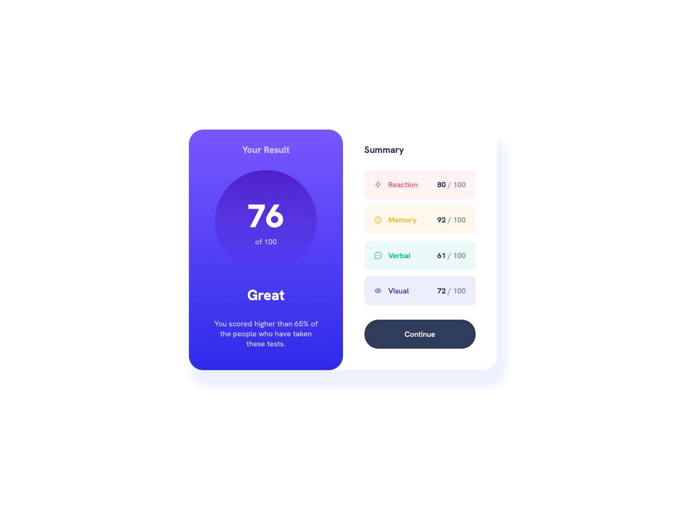

# Frontend Mentor - Results summary component solution

This is a solution to the [Results summary component challenge on Frontend Mentor](https://www.frontendmentor.io/challenges/results-summary-component-CE_K6s0maV). Frontend Mentor challenges help you improve your coding skills by building realistic projects. 

## Table of contents

- [Overview](#overview)
  - [Screenshot](#screenshot)
  - [Links](#links)
- [My process](#my-process)
  - [Built with](#built-with)
  - [What I learned](#what-i-learned)
  - [Continued development](#continued-development)
  - [Useful resources](#useful-resources)
- [Author](#author)
- [Acknowledgments](#acknowledgments)

**Note: Delete this note and update the table of contents based on what sections you keep.**

## Overview

### Screenshot



### Links

- Live Site URL: [frontendmentor.jagur.dev/results-summary-component](https://frontendmentor.jagur.dev/results-summary-component)

## My process

### Built with

- Good ole HTML and CSS

### What I learned

#### 1. [every-layout.dev](https://every-layout.dev) 

I took some time to work through, read, and test out the content at [every-layout.dev](https://every-layout.dev) (and I highly recommend it) before working on this project. It really opened my eyes to a whole new level of frontend development. It, along with [cube css](https://cube.fyi), really shaped how I worked on this project. It was a joy and it would be difficult to write out everything I learned by working through it. I'm glad I did, and I will continue to use both of them as I try to learn more with them.

#### 2. Using `role` in HTML

Discovered this while reading and learning from [every-layout.dev](https://every-layout.dev). I was not aware you could use a tag and give it the role of another. I used it here to make the main card `article` the main element.

```html
<body>
  <article role="main"></article>
</body>
```

#### 3. Relative Color Syntax

Using this new and upcoming CSS relative color syntax really made it easy to declare transparent versions of colors:

```css
--surface-red: hsl(from var(--accent-red) h s l / 8%);
--surface-yellow: hsl(from var(--accent-yellow) h s l / 8%);
--surface-green: hsl(from var(--accent-green) h s l / 8%);
--surface-blue: hsl(from var(--accent-blue) h s l / 8%);
```

### Continued development

- Really looking forward to continuing to learn and use [every-layout.dev](https://every-layout.dev) and [cube css](https://cube.fyi). I will use them in future projects and go back to read more. I want and need more practice with these technologies as I continue to explore better ways to write frontend code.

### Useful resources

- [every-layout.dev](https://every-layout.dev) - Absolutely and easily worth every penny for the amount of knowledge here. The header for the site is 'Learn to write better, resilient CSS', and you absolutely accomplish that by reading this.
- [cube css](https://cube.fyi) - A very intuitive and quick-to-learn methodology for writing and organizing your CSS code. 
- [buildexcellentwebsit.es](https://buildexcellentwebsit.es) - To quote from the website directly: This website was the focal point of a talk, [Andy Bell](https://andy-bell.co.uk/) (also happens to be the author of the two resources above) did in 2022. You can [watch him deliver it as a closing keynote, here](https://youtube.com/watch?v=5uhIiI9Ld5M). Some excellent points and resources to be found here.
- [Utopia](https://utopia.fyi) - design token generators for proportional scaling and fluidity. It's the source of my sizes in `style.css`.
- [ColorSlurp](https://colorslurp.com) - a free color picker MacOS app. Great for visualizing the style guide given during these FrontendMentor projects. Found it while looking for an easy way to visualize the color palette for this project.

## Author

- Website - [jagur.dev](https://jagur.dev/)

## Acknowledgments

- As always the man, the legend, [Kevin Powell (YouTube)](https://www.youtube.com/@KevinPowell). I'm sure my frontend journey would be much worse without this man. He is an invaluable resource for learning and exploring frontend development.
- I have to acknowledge [Andy Bell](https://andy-bell.co.uk/) for all his work on the resources I listed above. His hard work and passion for CSS inspire me as a developer. 
